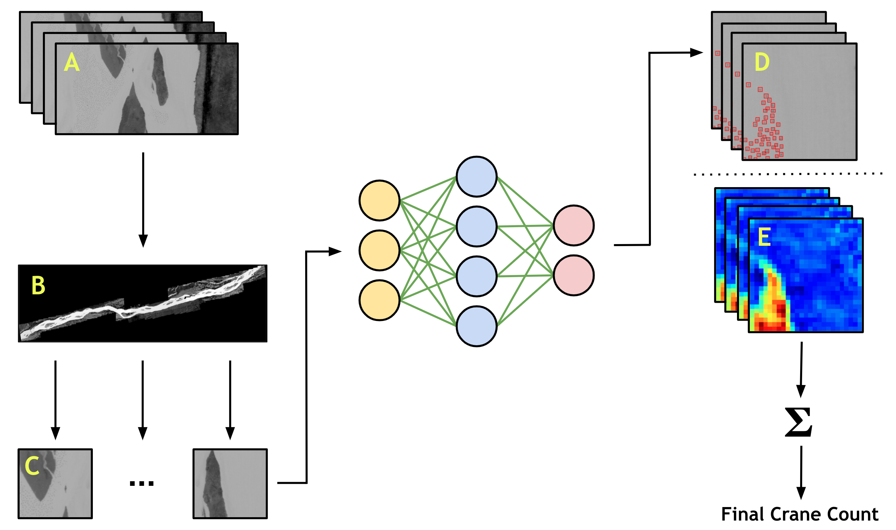

# counting-cranes

This repository contains the code for my research with William & Mary's Institute for Integrative Conservation (IIC), the U.S. Fish & Wildlife Service (USFWS), and the U.S. Geological Survey (USGS). Applying deep learning approaches from the object counting literature, I aim to streamline the monitoring process for sandhill cranes. USFWS runs this survey each spring at the Platte River Valley of Nebraska.

## The Pipeline

A major deliverable for this project is a data processing pipeline that is able to efficiently count cranes in thermal aerial imagery. The pipeline has two major components: crane counting and overlap resolution. The pipeline is designed to be modular to allow for some flexibility in the selected methods. This means that new methods can be inserted as necessary, to reflect advances in object counting approaches or better methods for overlap resolution.

The above figure provides an overview of the pipeline used for counting sandhill cranes (Antigone canadensis). For context, the model used has already been trained and we focus instead on prediction. We begin in A with a dataset of thermal aerial images. In B, the overlap between said images is resolved using an orthomosaicking approach, resulting in one large orthomosaic. The orthomosaic is then split into non-overlapping tiles in C. The sub-images pass through a model to produce predicted bounding boxes in D or predicted density maps in E. Finally, the detections in D are counted or the density maps in F are summed over for all tiles, resulting in a final crane count for the starting dataset from A. See `full_pipeline.py` for the implementation of this pipeline.

### Crane Counting

The prediction component handles the identification, localization, and enumeration of cranes. For the prediction portion of the pipeline, I experiment with both object detection (Faster R-CNN) and object counting (ASPDNet) approaches. The detection approach is more naive, but also more in line with previous efforts within conservation research. I test ASPDNet, a density estimation method, alongside Faster R-CNN to compare the performance of the two approaches.

Both deep learning models were implemented in `PyTorch` using the `PyTorch Lightning` framework. See the `object_detection` folder for the implementation of Faster R-CNN and the `density_estimation` folder for the ASPDNet implementation.

### Overlap Resolution

The overlap resolution component combats over-counting in the final estimate that arises due to front-to-back overlap between contiguous images in a flight line. This secondary component introduces an additional challenge to the task, as counts cannot simply be aggregated across all images in isolation. I experiment with a few methods that are not spatially aware, which I found to be inferior to spatially-aware methods. In the end, we opted to use simple orthomosaicking for overlap resolution.

## Analyses

All analyses were performed on [Google Colab](https://research.google.com/colaboratory/). The notebooks for these analyses are in `analyses`.

## Miscellaneous

- The `config.json` file is used to hold filepaths, hyperparameters, and more. Make sure to update this file with your local directory structure before trying ot run any of the code.
- All Python packages used are included in `requirements.txt`--simply use the command `pip install requirements.txt`.
- The scripts `bird_dataset.py` and `utils.py` include important utility methods to read in, preprocess, manipulate the data, and more.
- Make sure to explore the `README.md` files in the subdirectories (in `density_estimation`, for instance) to get more information about the source code that I am adapting from other studies.
- _**DISCLAIMER:** the findings and conclusions in this work are those of the authors and do not necessarily represent the views of the U.S. Fish and Wildlife Service._
